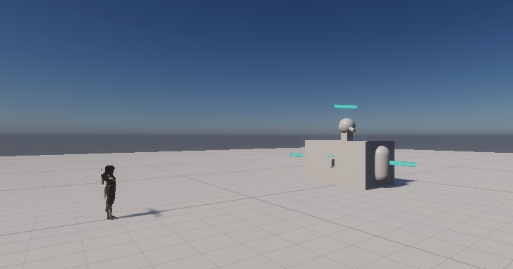
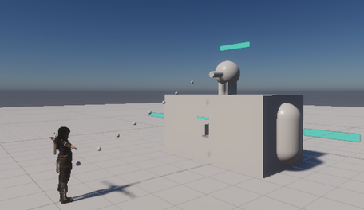

# Component Tearing

__Game Project that is inspired by Horizon Zero Dawn(https://www.playstation.com/en-us/horizon/) and Arc Raiders(https://arcraiders.com/en/)__

  

* Engine Configuration
  
  |Engine|Version|
  |------|-------|
  |Unity|6000.1.17f1|
* Previously
  |Engine|Version|
  |------|-------|
  |Unity|6000.1.2f1|


## Basic Description

This project involves the player and one enemy; the enemy is composed of 4 breakable components. Three of said components are seperate attacks, and the fourth is it's "Core". As you break each of the enemy's weapons off the core will be exposed and allow the player to break it. Once the core is broken the enemy will be defeated and the game beaten.

## Features

#### Enemy
* Turret
* Flamethrower
* Mortar - Not Implemented yet
* Core - Not Fully Implemented yet

#### Player
* Primary Attack - Not Implemented yet
* Dodge/Dash - Not Implemented yet

____
## Structure

The project is composed of the following major classes:

#### Components

The ```Components``` class has the following responsibilities:

* Parent Class to each Enemy Component

* Governs Health and Damage Taken

* Determines if each component can see the player
  
#### Turret Component

The ```TurretComponent``` is a child class of the ```Components``` class that dictates how the turret acts:

* Lock onto player when seen

* Rotate/Scan area when not seeing player

* Shoot player by spawning objects then Impulsing them

```c#
Vector3 PlayerInputToWorldDir(Vector2 inputVal)
{
    if (SeePlayer() && canShoot)
      {
         canShoot = false;
         //actual shoot script
         GameObject bullet = Instantiate(bulletObject, barrelTip.position, Quaternion.identity);
         //Destroy after 5 sec in case misses player
         Destroy(bullet, 5f);
         Rigidbody bulletRB = bullet.GetComponent<Rigidbody>();
         Vector3 playerDir = (playerController.transform.position - transform.position).normalized;
         bulletRB.AddForce(playerDir * 10f, ForceMode.Impulse);
         yield return new WaitForSeconds(fireRatePerSec);
         canShoot = true;
      }
}
```



#### Flamethrower Component

The ```FlamethrowerComponent``` is a child class of the ```Components``` class that dictates how the Flamethrower acts:

* Seperate boundary boxes for seeing player and damage area
* Attacks when see's player 
* Damage only inflicted if player is in damage boundary
```C#
if (canAttack)
        {
            canAttack = false;
            
            //call player damage function on tic rate
            if (InAttackRange())
            {
                playerController.TakeDamage(flameDamage);
            }
            yield return new WaitForSeconds(secBetweenDamage);

            canAttack = true;
        }
```

#### Player Controller

The ```PlayerController``` houses all fuctions that interact with the enemy scripts and added movement functions:

* Health
* Dodge - Not Added Yet
* Primary Fire - Not Added Yet